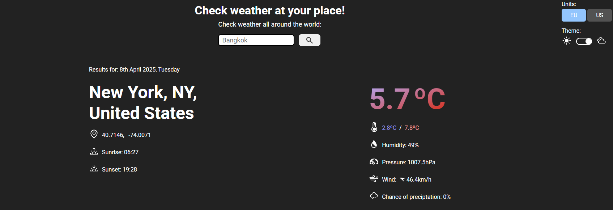

# Weather App 🌤️

Simple weather app powered by the **Visual Crossing API** ([visualcrossing.com](https://www.visualcrossing.com/)) to show real-time weather data from anywhere in the world.

## Key Features 🚀

-  Search any city or country for instant weather updates
-  Hourly forecast
-  15-Day forecast
-  Dark / Light Mode
-  EU / US unit Conversion

## Built With 🛠️

-  Webpack for bundling
-  HTML & CSS
-  JavaScript

## What I Learned 💡

-  How to integrate and interact with APIs
-  Working with asynchronous JavaScript and handling promises

## Preview 📸

---

## Acknowledgments

-  Visual Crossing API ([visualcrossing.com](https://www.visualcrossing.com/)) - providing the weather data.
-  [The Odin Project](https://www.theodinproject.com/) Curriculum
