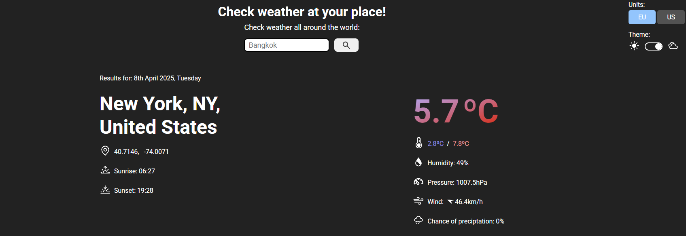
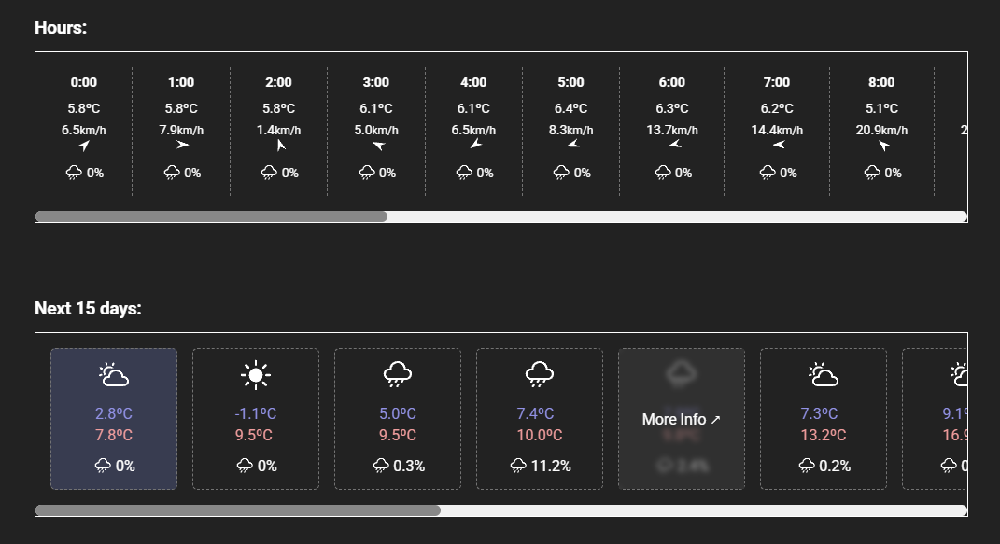

# Weather app

Simple app to check forecast of the region/city/country.

Weather data from Visual Crossing API.

## Preview

---

## Functions

-  search for any city or country
-  hourly forecast
-  forecast for the next 15 days
-  light / dark mode
-  EU / US unit converter

## Build using:

-  webpack
-  HTML
-  CSS
-  JS ES6 modules

## What I learned

-  connecting with API
-  asynchronous code

## Authors

-  Me (https://github.com/mmareqq)

## Acknowledgments

-  Visual Crossing API (https://www.visualcrossing.com/)
-  The Odin Project (https://www.theodinproject.com/)
